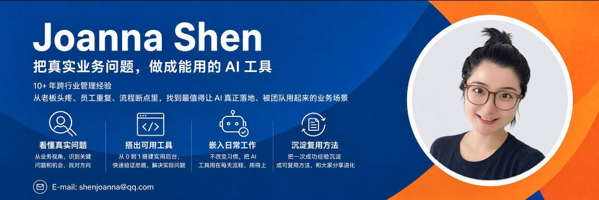
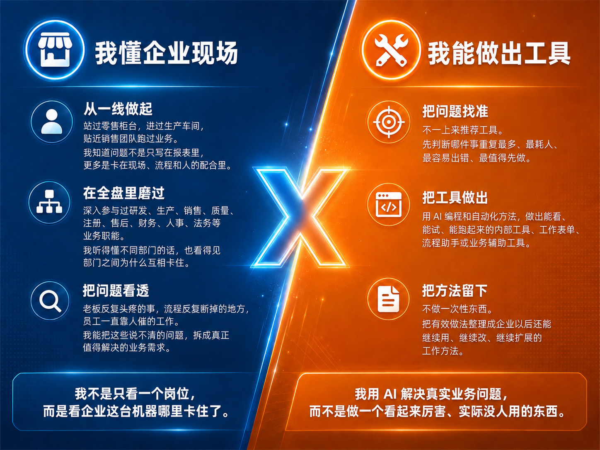
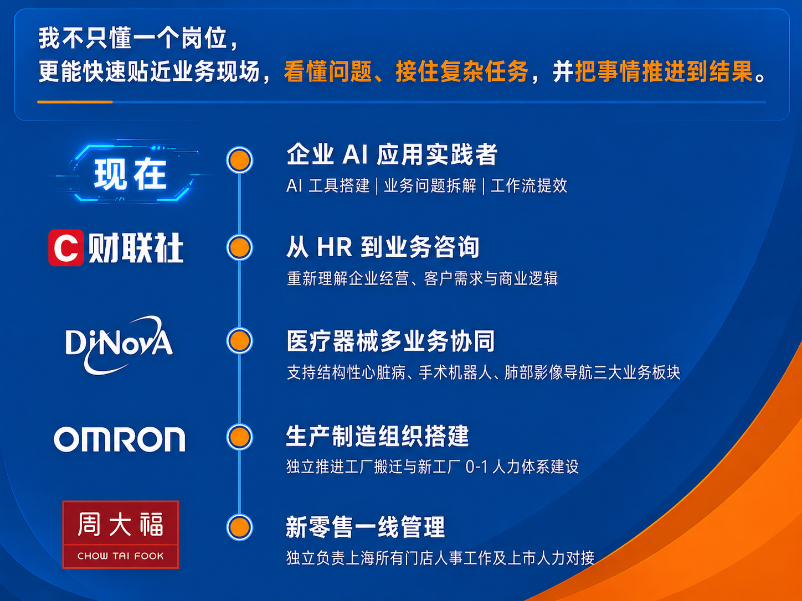

  

 

<h1 align="center">你好，我是 Joanna Shen</h1>

<h3 align="center">
  企业 AI 应用实践者｜业务问题拆解者｜可用工具搭建者
</h3>

  我关注的不是“把 AI 做得看起来很厉害”，而是把真实业务问题拆清楚，做成团队能用、能跑、能持续迭代的工具和方法。

  

 

## 我是谁

我有 10+ 年跨行业管理与业务协同经验，经历过一线零售、生产制造、医疗器械、业务咨询与企业 AI 应用实践。  
我习惯从业务现场出发，理解人的协作、流程的卡点、数据的断点，再判断 AI、自动化和内部工具应该放在哪里。

我现在最关注三件事：

- **看懂真实问题**：不是从工具出发，而是先判断哪件事重复最多、最耗人、最容易出错、最值得优化。
- **搭出可用工具**：用 AI 编程、自动化、表单、工作流和轻量应用，把问题变成可运行的解决方案。
- **沉淀复用方法**：不做一次性演示，而是把有效做法整理成团队以后还能继续用、继续改、继续扩展的方法。

 

## 我的双核心能力

  

 

## 我的职业与业务现场

  

 

## 我能解决什么

| 方向 | 我会怎么做 | 适合的场景 |
| :--- | :--- | :--- |
| **企业 AI 工作流提效** | 拆解重复任务，设计 AI 辅助流程，做成可执行 SOP 或轻量工具 | 资料整理、研究分析、日报周报、跨部门信息同步 |
| **内部业务工具搭建** | 用 AI 编程与自动化工具，把表格、流程、知识库变成可操作系统 | HR、销售支持、运营管理、内容生产、项目协同 |
| **业务问题诊断** | 从一线流程、人员协作、管理目标里找到真正卡点 | 流程反复、沟通成本高、工具很多但没人用 |
| **方法沉淀与团队上手** | 把工具使用方式、判断标准和复用模板整理成团队资产 | 企业内部 AI 推广、部门效率升级、个人工作流重建 |

 

## 我常用的工具栈

  
  
  
  
  
  
  
  

 

## 我正在构建的方向

- 把企业里的“重复但重要”的工作拆成 AI 可辅助的流程。
- 把个人经验沉淀成可迁移的方法、模板、工具和案例。
- 从 HR、业务咨询、医疗器械和一线运营经验里，持续寻找真正值得 AI 改造的场景。
- 用小工具验证需求，用真实反馈决定是否继续产品化。

 

## 联系我

<table>
  <tr>
    <td width="180" align="center" valign="middle">
       
      扫码添加微信
    </td>
    <td valign="middle">
      
<strong>微信：</strong><code>JoannaLab</code>

      
<strong>邮箱：</strong><code>shenjoanna@qq.com</code>

      
<strong>备注：</strong>如果你是从 GitHub 看到我，添加时可以备注「GitHub」。

      
<strong>交流方向：</strong>企业 AI 应用、业务流程提效、HR 数字化、内部工具搭建。

    </td>
  </tr>
</table>

 

---

  把真实业务问题，做成能用的 AI 工具。

